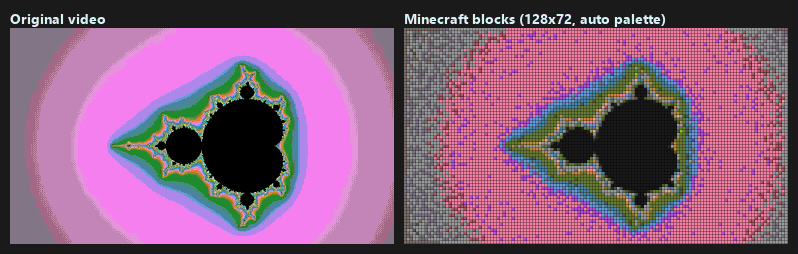

# Minecraft Bedrock Video Player

[](LICENSE)
[](https://www.python.org/)
[](https://www.minecraft.net/)
[](#-releases)
[](https://github.com/ntk758/MinecraftAddon_Bedrock_Video-Player/actions/workflows/ci.yml)
[](#)

<p align="center">
  
  <br>
  <sub>左: 元映像 / 右: 128×72 ブロックに変換した映像 (ゲーム内と同じ規則で復元した画面) — Left: source / Right: converted to blocks</sub>
</p>

**▶ すぐ試す / Try it now:** [リリースページ](https://github.com/ntk758/MinecraftAddon_Bedrock_Video-Player/releases/latest) から `BlockVideoPlayer-sample-v5.4.0.mcaddon` (サンプル映像入り) をダウンロードしてインポートするだけで再生できます。自分の動画を変換するときは Windows 用の `BlockVideoPlayer-v5.4.0-windows-x64.zip` (Python 不要) を使ってください。
Download the sample add-on or the Windows app (no Python needed) from the [latest release](https://github.com/ntk758/MinecraftAddon_Bedrock_Video-Player/releases/latest).

[日本語](#日本語-japanese) | [English](#english)

## 日本語 (Japanese)

### 📖 概要 (Overview)
> **⚠️ 重要事項 (Important Note):**
> このプロジェクトは、コアアルゴリズム設計からPythonスクリプト、Bedrock Script API、GUIアプリケーション、最適化ロジック、そしてこのREADMEに至るまで、**すべて AI (Claude Opus / GPT / Gemini Pro等のエージェント) によって自律的に設計・プログラミング・構築されたものです**。

Minecraft Bedrock Edition（統合版）で、MP4 などの動画ファイルを「マイクラのブロック」へ変換し、ゲーム内で映像と音声を同期再生できるアドオン構築ツールです。GUI で動画を選んでボタンを押すだけで、そのままインポートできる `.mcaddon` を作成します。

### ✨ 特徴 (Features)
- 🎬 **MP4 等の動画から直接ブロック動画アドオンを生成** (映像は Behavior Pack、音声は Resource Pack)
- 🎵 **音声の同期再生** (10 秒単位の OGG に分割し、再生位置に合わせて切り替え)
- 🎮 **ゲーム内リモコン** (コンパスを使うと再生・一時停止・シーク・音量・動画切替の画面が開く)
- 📚 **マルチ動画対応** (1 つのアドオンに複数の動画を収録)
- 👑 **マイクラ実在ブロック 39 色パレット** (コンクリート・テラコッタ・発光ブロック) と、動画ごとに色を選ぶ自動パレット
- 🗜 **差分圧縮** (変化したブロックだけを書き換える RLE + VarInt 形式。シーンごとのキーフレームで高速シーク)
- ⚡ **GPU 変換対応**: NVIDIA (CUDA)・AMD (ROCm / DirectML)・Intel (DirectML)。GPU が無くても CPU で変換可能
- 🌐 **10 言語対応**: 日本語・English・简体中文・繁體中文・한국어・Español・Português (Brasil)・Français・Deutsch・Русский。GUI は画面右上で切り替え、ゲーム内のメッセージとリモコン画面は各プレイヤーの Minecraft の言語設定で表示

### 💻 必要な環境 (Requirements)
| 項目 | 内容 |
|---|---|
| OS | Windows 10 / 11 (変換ツール)。Linux でもコマンドラインで変換可能 |
| Minecraft | Bedrock Edition 最新版 (安定版 Script API `@minecraft/server` 1.19.0 / `@minecraft/server-ui` 1.2.0 を使用。**ベータ API は不要**) |
| Python | **3.12** (3.13 でも CPU 変換は動きますが、AMD GPU 用の DirectML は 3.12 までの対応です) |
| FFmpeg | PATH に通すか、`video_player_gui.py` と同じフォルダに `ffmpeg.exe` を置く |
| GPU (任意) | NVIDIA / AMD / Intel。PyTorch の追加が必要 ([GPU の設定](#4-gpu-の設定-任意)) |

### 🚀 インストールと使い方 (Installation & Usage)

#### 1. Python のインストール
- **Microsoft Store**: [Python 3.12 をインストール](https://apps.microsoft.com/detail/9ncvdn91xzqp) (推奨・最も簡単です)
- **公式サイト**: [Python.org](https://www.python.org/downloads/windows/) から 3.12 のインストーラーをダウンロード (「Add Python to PATH」に必ずチェック)

#### 2. FFmpeg のインストール
- **winget を使う場合**: コマンドプロンプトまたは PowerShell で次を実行し、ターミナルを開き直します。
  ```bash
  winget install Gyan.FFmpeg
  ```
- **手動インストール**: [FFmpeg 公式サイト](https://ffmpeg.org/download.html) から Windows 向けビルド (gyan.dev 等) を入手し、`ffmpeg.exe` をこのツールのフォルダに置くか PATH に追加します。

#### 3. ツールのセットアップ
このリポジトリをダウンロード (ZIP を解凍、または `git clone`) し、フォルダ内で必要なパッケージをインストールします。
```bash
pip install -r requirements.txt
```

#### 4. GPU の設定 (任意)
GPU を使わない場合はこの手順は不要です。

| GPU | OS | インストール方法 |
|---|---|---|
| NVIDIA | Windows / Linux | [PyTorch 公式サイト](https://pytorch.org/get-started/locally/) の CUDA 版 `torch` |
| AMD Radeon | Windows | `pip install -r requirements-directml.txt` (DirectML) または AMD 公式の ROCm 版 PyTorch for Windows (対応 GPU は AMD のドキュメントを参照) |
| AMD Radeon | Linux | [PyTorch 公式サイト](https://pytorch.org/get-started/locally/) の ROCm 版 `torch` |
| Intel Arc / 内蔵 GPU | Windows | `pip install -r requirements-directml.txt` (DirectML) |

- GUI の「変換デバイス」が **自動** なら **CUDA / ROCm → DirectML → CPU** の順に使えるものを選びます。DirectML では内蔵 GPU より単体 GPU を優先します。
- 変換前に GPU で小さなテスト変換を行い、失敗した場合は自動で CPU 変換に切り替えます。
- 実際に使われたデバイスは処理ログの `[MVCodec] 減色デバイス: AMD Radeon RX 9070 XT (directml)` (英語表示では `Conversion device:`) のような行で確認できます。
- GPU 経路は OkLab 色空間での色合わせ・知覚的なレート歪み最適化 (RDO)・時間方向ディザを行うため、CPU 経路 (Pillow) とは仕上がりが異なり、容量は小さめになります。処理が重い分、**変換全体が CPU より速くなるとは限りません** (例: RX 9070 XT + DirectML、256×256 で減色処理は約 200 fps)。
- GPU で処理できるディザは「なし / Blue Noise / Ordered」です。それ以外のディザを選ぶと CPU で処理されます。

#### 5. GUI で .mcaddon を作成
```bash
python video_player_gui.py
```
画面右上の **🌐 言語 (Language)** で表示言語を切り替えられます。初回は Windows の表示言語に合わせて選ばれ、選んだ言語は次回以降も使われます (入力中の内容はそのまま引き継がれます)。

1. **動画リスト**: 「動画を追加」で動画を選びます (複数可)。「ID編集」で動画 ID (英小文字・数字・`_`)、「サムネ秒編集」でアイコンに使う場面を変更できます。
2. **出力 .mcaddon**: 保存先を指定します。
3. **パック名・実行コマンド**: パック表示名と、ゲーム内コマンドの接頭辞 (既定 `badapple`) を設定します。
4. **変換・再生設定**:

   | 設定 | 説明 |
   |---|---|
   | 画質プリセット | 幅・高さ・再生間隔をまとめて設定します (下表) |
   | 幅 / 高さ | スクリーンのブロック数 (最大 512) |
   | 再生間隔 (tick) | 1 フレームを表示する tick 数。20 ÷ 間隔 = fps |
   | キーフレーム間隔 | 何フレームごとに全画面を描き直すか (シークの速さに影響)。0 ならシーンの先頭のみ |
   | パレット | 自動 (動画ごとに最適化) / 全 39 色 / 拡張 33 色 / 基本 16 色 |
   | ディザリング | なし / Blue Noise / Ordered (GPU 対応)、Floyd-Steinberg / Atkinson / Burkes / Sierra Lite (CPU のみ) |
   | 知覚最適化 | 輪郭部分だけにディザをかけて、平坦部のちらつきを抑えます |
   | 変換デバイス | 自動 / NVIDIA CUDA・AMD ROCm / DirectML / CPU のみ |

   | 画質プリセット | 解像度 | fps | 目安 |
   |---|---|---|---|
   | 軽量 | 64×64 | 20 | 動きの多い動画・低スペック向け |
   | 標準 | 96×96 | 10 | |
   | 高画質 (既定) | 128×128 | 10 | |
   | 高精細 | 128×128 | 5 | |
   | ウルトラ | 256×256 | 5 | 重い。PC 版推奨 |
   | 極限 | 512×512 | 2 | 非常に重い。PC 版推奨 |
5. **「.mcaddon を作成」** を押すと、処理ログに進行状況が表示され、完了するとダイアログが出ます。

#### 6. Minecraft で再生
1. 作成した `.mcaddon` をダブルクリックしてインポートします。
2. ワールドの設定で **ビヘイビアーパック** と **リソースパック** の両方を有効にします (同じパック名で 2 つあります)。`/scriptevent` を使うため **チートを有効** にしてください。
3. スクリーンを置きたい場所に立ち、次のコマンドを実行します (`badapple` は GUI で設定した接頭辞)。
   ```
   /scriptevent badapple:setup
   ```
   スクリーンは **プレイヤーの足元の高さに、東 (+X) と北 (-Z) 方向へ水平に** 作られます。範囲内のブロックは上書きされるので、平らで何もない場所で実行し、上空から見下ろしてください。
4. **コンパスを使う** (右クリック / 長押し) とリモコンが開きます。

| リモコンのボタン | 動作 |
|---|---|
| ▶ 再生 / 再開・⏸ 一時停止 | 一時停止やシークした位置から再開します |
| ⏹ 停止 ＆ クリア | 再生を止め、スクリーンを単色 (パレットの先頭のブロック) で塗りつぶします |
| ⏭ 次の動画・⏮ 前の動画・📜 動画リスト | 再生する動画を切り替えます |
| 🔊 音量設定 | 0〜100% |
| ⏩ シーク | 秒数を指定して移動します (移動後は一時停止) |

| コマンド | 動作 |
|---|---|
| `/scriptevent badapple:setup` | 現在地にスクリーンを設置 |
| `/scriptevent badapple:start` | 選択中の動画を最初から再生 |
| `/scriptevent badapple:list` | 収録動画の一覧 |
| `/scriptevent badapple:play <動画ID>` | 指定した動画を再生 |
| `/scriptevent badapple:gui` | リモコン画面を開く |
| `/scriptevent badapple:stop` | 停止してスクリーンを単色で塗りつぶす |

#### スタンドアロン EXE (任意)
ビルド済みの EXE は [リリースページ](https://github.com/ntk758/MinecraftAddon_Bedrock_Video-Player/releases/latest) からダウンロードできます (DirectML 同梱)。自分でビルドする場合は PyInstaller を使います。DirectML (torch-directml) がビルド環境に入っていれば同梱されます。
```bash
pip install pyinstaller
python build_standalone.py
```
`dist/BlockVideoPlayer/BlockVideoPlayer.exe` ができます。同じフォルダに `ffmpeg.exe` を置くと PATH の設定が不要になります。

---

## English

### 📖 Overview
> **⚠️ Note:** This entire project—including the Python scripts, Minecraft add-on JavaScript, GUI application, and this README—was **fully designed, programmed, and generated by AI**.

A tool that converts video files (MP4, etc.) into Minecraft blocks and builds a `.mcaddon` that plays them in Minecraft Bedrock Edition with synchronized audio. Pick your videos in the GUI, press one button, and import the result.

### ✨ Features
- 🎬 **Video → block add-on** (video in the Behavior Pack, audio in the Resource Pack)
- 🎵 **Synchronized audio** (10-second OGG chunks switched by playback position)
- 🎮 **In-game remote control** (use a compass: play/pause, seek, volume, switch videos)
- 📚 **Multiple videos per add-on**
- 👑 **39-color palette of real blocks** (concrete, terracotta, light sources) plus a per-video automatic palette
- 🗜 **Delta compression** (only changed blocks are rewritten; RLE + VarInt, per-scene keyframes for fast seeking)
- ⚡ **GPU conversion** on NVIDIA (CUDA), AMD (ROCm / DirectML) and Intel (DirectML); CPU works too
- 🌐 **10 languages**: Japanese, English, Simplified/Traditional Chinese, Korean, Spanish, Portuguese (Brazil), French, German, Russian — in the GUI (selector at the top right) and in game (chat messages and the remote follow each player's Minecraft language)

### 💻 Requirements
- **OS**: Windows 10 / 11 for the GUI (the CLI also runs on Linux)
- **Minecraft**: latest Bedrock Edition (stable Script API `@minecraft/server` 1.19.0 / `@minecraft/server-ui` 1.2.0 — **Beta APIs are not required**)
- **Python**: 3.12 (3.13 works for CPU conversion, but DirectML supports up to 3.12)
- **FFmpeg**: on PATH or next to `video_player_gui.py`

### 🚀 Usage
1. `pip install -r requirements.txt`
2. Optional GPU: CUDA build of PyTorch (NVIDIA), ROCm build (AMD on Linux, or AMD's PyTorch for Windows), or `pip install -r requirements-directml.txt` (AMD / Intel on Windows). With **Device = Auto** the converter tries CUDA/ROCm → DirectML → CPU, runs a small self-test on the GPU and falls back to CPU if it fails. The log line `[MVCodec] Conversion device:` shows the device in use.
3. Run `python video_player_gui.py` (switch the UI language with **🌐 Language** at the top right — it follows your Windows display language by default), add videos, choose a quality preset / palette / dithering / device, and press **".mcaddon を作成"** (Create .mcaddon).
4. Import the `.mcaddon`, enable both the Behavior Pack and the Resource Pack, and turn on cheats (for `/scriptevent`).
5. Stand where the screen should be and run `/scriptevent badapple:setup` (`badapple` is the command prefix set in the GUI). The screen is built horizontally at your foot level, extending east (+X) and north (−Z); blocks in that area are overwritten.
6. Use a compass to open the remote control, or use `/scriptevent badapple:start | list | play <id> | gui | stop`.

A prebuilt Windows EXE (with DirectML) and a ready-to-play sample add-on are on the [latest release](https://github.com/ntk758/MinecraftAddon_Bedrock_Video-Player/releases/latest). To build the EXE yourself: `pip install pyinstaller` then `python build_standalone.py`.

---

## 📂 アーキテクチャとディレクトリ構成 (Architecture)

```text
.
├── video_player_gui.py        # GUI & pack builder (.mcaddon generator)
├── gui_i18n.py                # GUI translations loader, language detection, saved settings
├── locales/                   # Translations for the GUI, in-game texts (addon.*) and converter logs (convert.*); en.json is the reference
├── convert.py                 # Video → block data converter CLI (2-pass streaming, GPU/CPU)
├── mvcodec/                   # Codec library
│   ├── color.py               #   Palettes, dithering, OkLab
│   ├── auto_palette.py        #   Per-scene automatic palette (K-Means)
│   ├── device.py              #   GPU backend detection (CUDA / ROCm / DirectML)
│   ├── encode.py              #   RLE + VarInt encoder, 15-bit string packing
│   └── decode.py              #   Python reference decoder (benchmark / tests)
├── main.js                    # In-game player (Bedrock Script API)
├── codec.js                   # Minecraft-independent decoder shared by main.js and Node tests
├── manifest.json              # Behavior Pack manifest template
├── pack_metadata.py           # Version and release notes
├── build_standalone.py        # PyInstaller build for the standalone EXE
├── benchmark/                 # Quality / size benchmark (PSNR, SSIM, ΔE2000, LPIPS)
├── scripts/                   # Utilities (demo GIF generator)
├── docs/images/               # README demo GIF and social preview image
├── tests/                     # pytest + Node round-trip tests
└── requirements*.txt          # Runtime / dev / benchmark / DirectML dependencies
```

データ形式やゲーム内の描画方式の詳細は [ARCHITECTURE.md](ARCHITECTURE.md) を参照してください。

## 🛠 技術スタック (Tech Stack)
- **Python 3.12**: 変換処理と GUI (Tkinter)
- **NumPy / Pillow**: 減色・ディザ (CPU)
- **PyTorch**: GPU 減色 (CUDA / ROCm / DirectML)
- **FFmpeg**: フレーム抽出・OGG 音声分割
- **Minecraft Script API**: `setBlockPermutation` によるブロック描画と、`@minecraft/server-ui` のリモコン画面

## 🧪 開発者向け (Development)
```bash
pip install -r requirements-dev.txt
pytest -q
```
- `tests/test_codec_v4.py` は変換結果を Python デコーダと `codec.js` (Node.js が必要) の両方で復元し、一致・シーク・パレット切替を検証します。
- `tests/test_device.py` は GPU の選択と CPU へのフォールバックを検証します (PyTorch があれば GPU 用の処理も CPU で実行して確認)。
- GitHub Actions (`.github/workflows/ci.yml`) で push / PR ごとにテストと参考ベンチマークを実行します。

翻訳を追加・修正するには `locales/` の JSON を編集します。1 つのファイルに GUI (通常のキー)・ゲーム内の表示 (`addon.*`、引数は `%1` `%2`)・変換器のログ (`convert.*`) がまとまっています。
- 新しい言語は `en.json` をコピーして `<言語コード>.json` を作ると GUI の選択肢に現れます。ゲーム内でも使うには `gui_i18n.py` の `MINECRAFT_LOCALES` に Minecraft の言語コード (例: `it_IT`) を追加してください。
- ゲーム内の文字列は、GUI でビルドするときにリソースパックの `texts/*.lang` に書き出されます。翻訳が無い言語の Minecraft では英語 (`en_US`) で表示されます。
- `tests/test_i18n.py` がキーとプレースホルダーの過不足を、`tests/test_main_js.py` が `main.js` をモック環境で動かして、表示がすべて翻訳済みかを検査します。翻訳の改善 PR も歓迎です。

コマンドラインでの変換:
```bash
python convert.py --input-video in.mp4 --output out.js --width 128 --height 128 --fps 10 --palette auto --device auto
```

| 主なオプション | 説明 |
|---|---|
| `--input-video` / `--frames-dir` | 入力動画、または画像連番フォルダ |
| `--width` `--height` `--fps` `--duration` | 解像度・fps (最大 20)・変換する秒数 |
| `--palette` | `concrete` / `expanded` / `full` / `auto` |
| `--dither-method` | `none` / `blue_noise` / `ordered` / `floyd` / `atkinson` / `burkes` / `sierra` |
| `--device` | `auto` / `cuda` / `rocm` / `directml` / `cpu` |
| `--keyframe-interval` | キーフレーム間隔 (0 でシーン先頭のみ) |
| `--no-adaptive-fps` / `--no-perceptual` | 変化の少ないフレームの省略・知覚最適化を無効化 |
| `--ffmpeg` | ffmpeg のパス |

画質ベンチマーク:
```bash
pip install -r requirements-benchmark.txt
python benchmark/run.py --video in.mp4 --output out.js --fps 10
```

## ❓ よくある質問 (FAQ)

**Q. Java版で使えますか？ (Does this work on Java Edition?)**
A. いいえ、統合版 (Bedrock Edition) 専用です。

**Q. スマホやスイッチでも動きますか？ (Will it run on mobile/consoles?)**
A. `.mcaddon` 自体はどの端末の統合版でも動作するはずですが、高画質設定は非常に重いため PC 版を推奨します。

**Q. GPU があるのに CPU で変換されます。**
A. 処理ログの `[MVCodec]` の行を確認してください。PyTorch (または torch-directml) が入っていない場合や、GPU のテスト変換に失敗した場合は CPU になります。DirectML は Python 3.13 に対応していないため、Python 3.12 の環境に `requirements-directml.txt` を入れてください。Floyd-Steinberg などの CPU 専用ディザを選んでいる場合も CPU で処理されます。

**Q. 「ffmpeg が見つかりません」と表示されます。**
A. `ffmpeg -version` がターミナルで動くか確認してください。動かない場合は `ffmpeg.exe` をツール (または EXE) と同じフォルダに置いてください。

**Q. 再生が重い・カクつきます。**
A. 解像度を下げる (軽量・標準プリセット) か、fps を下げてください。1 tick あたりのブロック設置数には上限があり、超えた分は次の tick に持ち越されます。

**Q. 作り直したアドオンを入れたら同じパックが 2 つ並びます / 更新されません。**
A. パック名とコマンド接頭辞が同じなら同じパック (同じ UUID) として作られ、バージョンはビルドごとに上がります。名前か接頭辞を変えると別のパックとして扱われます。

## 🗺 ロードマップ (Roadmap)
- [x] MP4対応 (Video format support)
- [x] GUI実装 (GUI Builder)
- [x] 音声同期再生 (Audio Sync)
- [x] GPU対応 (NVIDIA CUDA / AMD ROCm・DirectML / Intel DirectML)
- [x] マルチ動画パック対応 (Multi-video support)
- [x] **Phase 7: Research Edition**
  - オブジェクト指向JSエンジン (VideoPlayer クラスによるマルチスクリーン再生)
  - 局所的SSIMベースの知覚的RDO (エッジ・ディテール保存)
  - シーン適応型パレット & シーンGOP (0.5*SAD + 0.3*Hist + 0.2*Edge)
  - 統合ベンチマーク (SSIM, PSNR, LPIPS, ΔE2000)
- [ ] **Phase 7.x: 次世代予測圧縮 (Next-Gen Prediction)**
  - Motion Vector Prediction (動き予測)
  - Tile Dictionary (タイル辞書圧縮)
- [ ] 3D立体ホログラム再生 (3D Hologram playback)

詳細は [TODO.md](TODO.md) を参照してください。

## 📝 謝辞 (Acknowledgments)
- Original Java Datapack idea inspired by [umbreonben/mc-cushion-bad-apple](https://github.com/umbreonben/mc-cushion-bad-apple).
- Video processing powered by **FFmpeg**.

## 🤝 コントリビュート (Contributing)
Issue や Pull Request はいつでも歓迎します！
Feel free to open an Issue or submit a Pull Request!

## 📜 ライセンス (License)
This project is licensed under the [MIT License](LICENSE).

---

## 🏷 Releases

- **v5.4.0**: ゲーム内表示の多言語対応。チャットのメッセージとリモコン画面が、各プレイヤーの Minecraft の言語設定 (10 言語、未対応の言語は英語) で表示されるように。変換器のログも GUI で選んだ言語で表示。`main.js` をモック環境で動かす結合テストを追加。
- **v5.3.0**: GUI の多言語対応。画面右上の「🌐 言語」で 10 言語 (日本語・English・简体中文・繁體中文・한국어・Español・Português (Brasil)・Français・Deutsch・Русский) に切り替え可能。初回は OS の表示言語を自動選択し、選んだ言語を保存。翻訳は `locales/*.json` で追加・修正できます。
- **v5.2.0**: AMD GPU 対応。ROCm 版 PyTorch (Linux / Windows) と DirectML (Windows の AMD / Intel GPU) で GPU 変換が可能に。GUI に「変換デバイス」選択を追加し、GPU の動作確認に失敗した場合は自動で CPU 変換へ切り替え。GUI からの変換が引数エラーで失敗していた v5.1.0 の不具合を修正。
- **v5.1.0**: 品質改善リリース。自動パレット使用時にシーン切替で色が崩れる問題 (GOP 先頭を必ずキーフレーム化)、横長動画・サムネイルが中央に配置されない問題、シーク後に再開できず先頭に戻る問題、別の動画を選んでも切り替わらない問題、EXE 版で変換できない問題を修正。再生速度を動画データの fps から決定、変換を 2 パスのストリーミング化してメモリ使用量を削減、盤面クリアの分割実行、再ビルド時もパック UUID を維持、CI でテストとベンチマークを実行するよう改善。
- **v5.0.0**: Phase 7 Research Edition。オブジェクト指向JSエンジンによるマルチスクリーン再生、SSIMベースの知覚的RDO、シーン適応型パレット＆GOPを導入。
- **v4.0.0**: Phase 6。OkLab知覚色空間への移行による色再現性の改善、シーン適応型の自動圧縮制御(RDO/ME)、NumPyベクトル化によるエンコード効率向上、予測型GOPプリフェッチとスマートティック予算による再生安定性の強化。
- **v3.2.0**: v4 GOP-Chunked 遅延デコードフォーマットを導入。GOP 単位の独立チャンク分割+LRUキャッシュにより、高解像度動画のワールド読み込み速度を改善。
- **v3.1.0**: Ultra-HD (512x512) 描画、バジェットベースRDO/MEによる負荷分散、v3バイナリ連結フォーマットによる高速ワールドロード、Temporal Dithering などを搭載。
- **v2.8.0**: Phase 4 MVCodec 導入。動的自動ブロックパレット生成 (K-Means)、Blue Noise ディザリングと知覚最適化フィルター、GUIへのベンチマーク表示機能を追加。
- **v2.7.0**: Zero-copy FFmpegパイプライン導入によるストリーミング対応、UTF-16バイナリエンコードによる容量削減、FFmpeg HWAccelのYUV破損バグを修正。
- **v2.6.4**: Script API での音声再生時、Bedrock 1.21以降の厳格な引数仕様(`location`)により音が鳴らない問題を修正。
- **v2.6.3**: `.mcaddon` 生成時に Script API の依存関係が消えてしまうバグを修正。
- **v2.6.2**: GUI起動時の変数初期化エラーを修正。
- **v2.6.1**: READMEの全面改修、GUIのディザリングGPU対応表記を最適化。
- **v2.6.0**: Ordered (Bayer) ディザリング時のGPUテンソル並列計算と、VRAMパンク(OOM)対策を実装。
- **v2.5.0**: 音声再生に完全対応。`.mcaddon` 形式へのアーキテクチャ刷新。
- **v2.1.0**: PyTorch GPU アクセラレーション統合。
- **v2.0.0**: 拡張パレット、ゲーム内リモコンGUI搭載。
